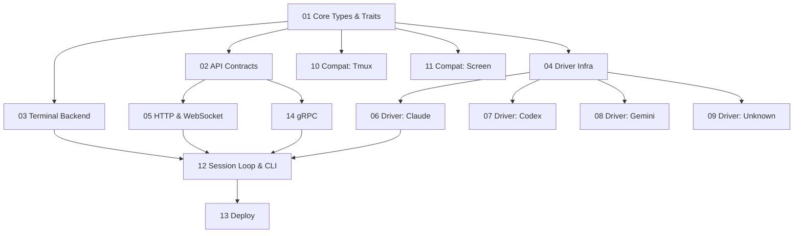

# Coop Roadmap

Dependency graph for parallelizable implementation. Each phase gates the
next; epics within a phase have no dependencies on each other and can run
concurrently.

## Phase 0: Contracts & Core Types

Shared types, trait definitions, and API surface that everything else codes
against. Small but must land first.

- [ ] **01 Core Types** — AgentState enum, PromptContext, OutputEvent,
  StateChangeEvent, InputEvent, ExitStatus, error codes. Terminal
  trait(s), Driver trait(s), Screen snapshot types. Everything is types
  and traits — no implementations.

- [ ] **02 API Contracts** — HTTP route signatures (request/response
  types), WebSocket message schema, protobuf definitions. Enough to
  write both server stubs and client code against.

## Phase 1: Core Modules & Compat (parallel)

Five independent workstreams. Core modules implement against Phase 0
traits. Compat backends only need the Backend trait from epic 01 — they
don't use VTE, ring buffer, or PTY spawn.

- [ ] **03 Terminal Backend** — Native PTY spawn (forkpty, AsyncFd),
  Screen (avt VTE wrapper), RingBuffer, non-blocking I/O. No detection,
  no transport — just "spawn a child and capture output."

- [ ] **04 Driver Infra** — CompositeDetector, IdleGraceTimer,
  HookReceiver (named pipe), LogWatcher (file notify), JsonlParser
  (stdout JSONL), ProcessMonitor (tier 4). Shared infrastructure that
  individual drivers compose from. No agent-specific parsing yet.

- [ ] **05 HTTP & WebSocket** — axum HTTP endpoints, WebSocket handler,
  auth middleware, write lock. Wired to trait objects — returns stub
  responses until a real backend and detector are plugged in.

- [ ] **14 gRPC** — tonic gRPC service, protobuf codegen. Same trait
  objects as HTTP, different transport. Optional at runtime via
  `--grpc-port`.

- [ ] **10 Compat: Tmux** — Tmux backend: attach to existing session,
  capture-pane 1s poll, send-keys input, resize-pane. Migration only —
  implements Backend trait, no ring buffer.

- [ ] **11 Compat: Screen** — GNU Screen backend: attach to existing
  session, hardcopy 1s poll, -X stuff input. No ANSI color. Migration
  only — implements Backend trait, no ring buffer.

## Phase 2: Agent Drivers (parallel)

Four independent drivers. Each composes detection infra (epic 04)
and implements NudgeEncoder/RespondEncoder.

- [ ] **06 Driver: Claude** — Tiers 1+2+(3)+4. Hook config, session log
  state parsing, prompt context extraction, nudge/respond encoding.

- [ ] **07 Driver: Codex** — Tiers 3+4. Stdout JSONL state parsing,
  nudge/respond encoding.

- [ ] **08 Driver: Gemini** — Tiers 1+2+3+4. Hook config
  (settings.json), session log parsing, nudge/respond encoding.

- [ ] **09 Driver: Unknown** — Tier 4 + optional tier 5 (screen regex
  via --agent-config). Null nudge/respond.

## Phase 3: Integration

Wire everything together. Depends on all of Phase 1 and at least one
driver from Phase 2.

- [ ] **12 Session Loop & CLI** — Session select loop (PTY + input +
  detector + screen debounce). CLI (clap, config, startup, signal
  handling, graceful shutdown). Integration tests: spawn coop, hit
  endpoints, verify state transitions.

## Phase 4: Deploy

- [ ] **13 Deploy** — Dockerfile, K8s sidecar/standalone manifests,
  health probes, resource limits. Only needs the working binary from
  Phase 3.
