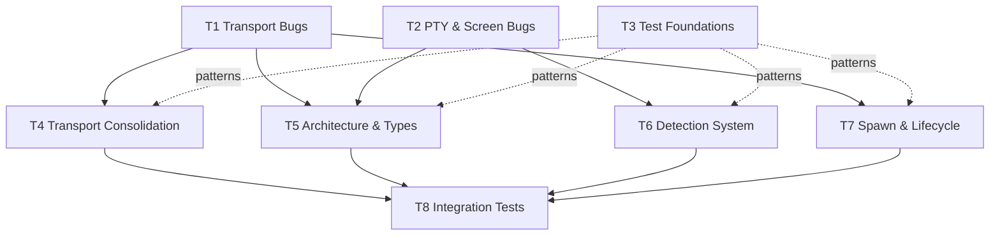

# Coop Tech Debt

Outstanding bugs, structural debt, and testing gaps identified by code
review against DESIGN.md, oddjobs, and gastown.  Organized as phased epics —
earlier phases unblock later ones.

## Phase 1: Bugs & Test Foundations (parallel)

Three independent workstreams.  T1 and T2 fix correctness issues.  T3
establishes shared test abstractions so that agents working on Phase 2 use
the right patterns instead of copying the existing duplicated helpers.

- [ ] **T1 Transport Bugs** — Fix protocol-level correctness issues across
  HTTP, WebSocket, and gRPC transports.
  - HTTP enter sends `\n` instead of `\r` (#47)
  - HTTP nudge doesn't gate on agent state; gRPC rejects when not
    `WaitingForInput`, HTTP/WS silently deliver (#48)
  - WebSocket write ops skip the write lock (#49)
  - Auth token comparison not constant-time (#53)
  - gRPC nudge/respond never acquire write lock (concurrent mutations
    possible)
  - HTTP/WS resize accepts invalid dimensions (0×0); gRPC rejects

- [ ] **T2 PTY & Screen Bugs** — Fix data integrity issues in the terminal
  backend and screen model.
  - Resize broken: TIOCSWINSZ unreachable after backend moves into task (#46)
  - Screen feed corrupts UTF-8 at chunk boundaries via lossy conversion (#51)

- [ ] **T3 Test Foundations** — Establish shared test abstractions before
  Phase 2 refactoring begins, so new test code follows good patterns.
  - Create shared test utility module with `TestAppState` builder,
    replacing 3 duplicate `make_app_state()` / `mock_app_state()` helpers
    (session_tests.rs, grpc_tests.rs, tests/session_loop.rs)
  - Add mock PTY backend implementing `Backend` trait for deterministic
    session tests (current tests spawn real subprocesses with `sleep`-based
    synchronization)
  - Add assertion helpers — standardize error-checking style (currently
    4 patterns: `unwrap_err` + contains, `is_err()`, `assert_eq!(err())`,
    `map_err`)
  - Convert existing passing tests to parameterized (`yare`): config
    validation (3 tests), `WriteLock` state transitions (10 tests), Claude
    state parsing (14 tests), auth validation (9 tests), encoding (8 tests)

## Phase 2: Structure & Systems (parallel, after Phase 1)

Four parallel workstreams.  T4 cleans up transport internals, T5
restructures shared types, T6 wires in the detection tier architecture,
T7 hardens the child process lifecycle.

- [ ] **T4 Transport Consolidation** — Eliminate duplicate code and make
  behavior consistent across HTTP, WebSocket, and gRPC.
  - Extract shared `deliver_steps()` helper — nudge/respond encoding loop
    is copy-pasted across all three transports (~54 lines × 3)
  - Extract shared `encode_response()` — respond handler state-matching
    (`PermissionPrompt`/`PlanPrompt`/`AskUser` → encoder call) duplicated
    across all three (~40 lines × 3)
  - Extract shared `read_ring_base64()` — ring buffer read + slice combine
    + base64 encode duplicated across all three
  - Delete duplicate `signal_from_name()` in http.rs; use shared
    `parse_signal()` everywhere (#52)
  - Unify key encoding: `encode_key` vs `keys_to_bytes` with different
    casing rules (#52)
  - Add signal send to WebSocket (HTTP/gRPC have it, WS doesn't)
  - Unify key validation: gRPC does per-key fast-fail, HTTP/WS silently
    skip bad keys
  - Dead code: `serve()` function, `prompt_to_http()` no-op clone
  - Misnamed `uuid_v4_simple` (counter, not UUID)

- [ ] **T5 Architecture & Types** — Reduce coupling and strengthen
  boundaries between terminal, driver, and transport layers.
  - Decompose `AppState` (17 public fields mixing 5 concerns) into
    focused sub-structs: terminal state, driver state, transport I/O,
    config/auth, lifecycle
  - Add `AppState` builder — update T3's `TestAppState` builder to match
    the new decomposed structure
  - Add `PromptContext` builder — 7 fields (6 optional), 3 factory
    functions each setting a different subset
  - Add `SessionConfig` builder or `Default` — recreated in 5+ tests
  - Replace closure-based prop drilling (`Arc<dyn Fn() -> T>`) in
    `ProcessMonitor`, `ScreenParser`, `build_detectors` with a concrete
    `DetectorContext` struct
  - Use `AgentType` enum in `AppState` instead of `String`
  - Use signal enum/newtype in `InputEvent::Signal` instead of raw `i32`
  - Fix exit-status capture race: `exit_status` and `agent_state` written
    in separate `RwLock` scopes (`session.rs:243-250`); reader can see
    one but not the other
  - Upgrade `child_pid` from `Ordering::Relaxed` to `Acquire`/`Release`
    (used for control flow in signal delivery, not just metrics)

- [ ] **T6 Detection System** — Complete the detection tier architecture
  that was designed but never wired in (#50).
  - Wire `CompositeDetector` with tier priority resolution
  - Integrate `IdleGraceTimer` into session loop
  - Populate `since_seq` and `detection_tier` in API responses (currently
    hardcoded to `0` and `"unknown"`)
  - Use `idle_timeout` config (currently parsed but ignored)
  - Add state-change dedup (`prev != next` check before broadcast)
  - Use `ProcessMonitor` `_active` flag or remove dead code
  - Add error categorization (unauthorized, out-of-credits, rate-limited,
    no-internet) per oddjobs patterns

- [ ] **T7 Spawn & Lifecycle** — Handle startup prompts and improve
  process management, informed by oddjobs and gastown patterns.
  - Auto-handle Claude startup prompts (bypass-permissions, workspace
    trust, login/onboarding detection)
  - Add nudge serialization (per-session mutex to prevent interleaving)
  - Improve process cleanup beyond PTY fd close + 50ms sleep (signal
    child tree, grace period, SIGKILL fallback)
  - Add ready-detection after spawn (poll for prompt or process change)
  - Add session resume support (`--resume` with session log discovery)

## Phase 3: Integration Tests (after Phase 2)

Exercising the corrected and consolidated code end-to-end.  Depends on
Phase 2 so tests cover the final behavior rather than enshrining bugs.

- [ ] **T8 Integration Tests** — Add the integration and stress test
  coverage that requires corrected transports and wired detection.
  - WebSocket integration: actual `ws_handler` with auth flow, lock
    lifecycle, subscription filtering, concurrent clients, replay bounds
  - gRPC integration: actual tonic service tests, streaming, error codes
  - Concurrent detector test: multiple detectors emitting simultaneously,
    verify tier resolution
  - File rotation tests for `LogWatcher` and `HookReceiver`
  - PTY edge cases: EOF/EIO handling, resize validation (TIOCSWINSZ
    succeeds and child sees new dimensions)
  - Write lock stress: concurrent HTTP + WebSocket writers
  - Large output: >64KB through ring buffer and HTTP output endpoint
